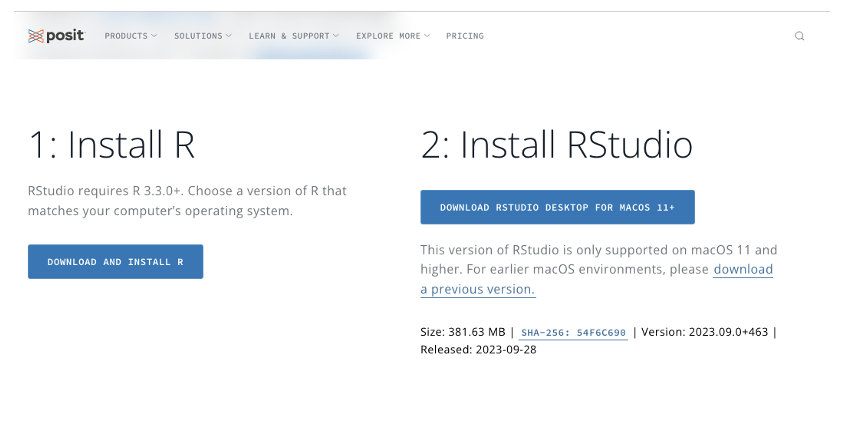
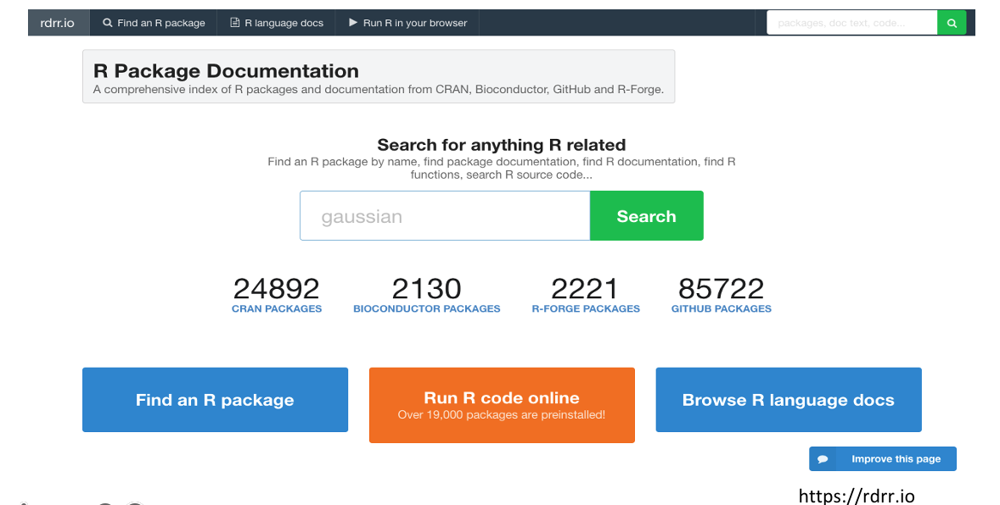
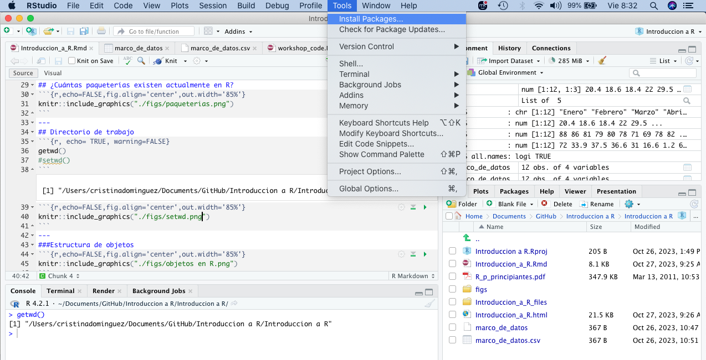
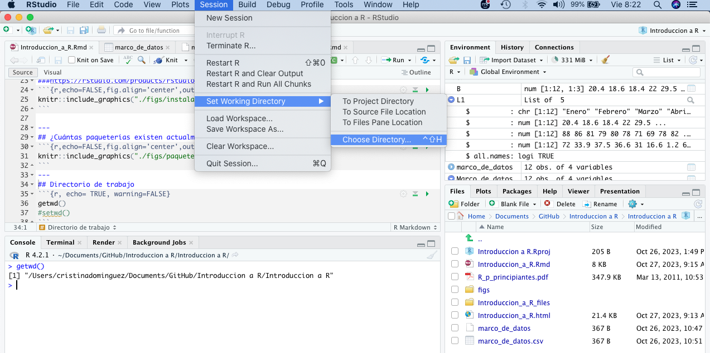
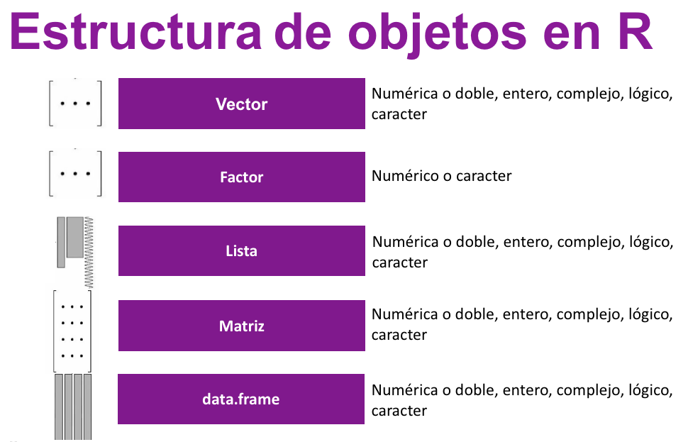
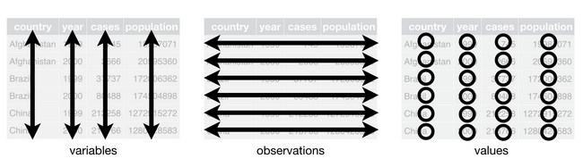

class: inverse, center, middle

# R 

##R es un proyecto de estadística computacional. Desarrollado en un lenguaje de programación Funcional y Orientado a Objetos, dándole versatilidad y extensibilidad mediante los paquetes disponibles en CRAN (Red de Archivos de R), Bioconductor y GitHub.
---

# Instalar R y RStudio

###https://rstudio.com/products/rstudio/download/
```{r,echo=FALSE,fig.align='center',out.width='85%'}

```

---
## ¿Cuántas paqueterías existen actualmente en R?
```{r,echo=FALSE,fig.align='center',out.width='85%'}

```
---
## Instalar paqueterias
###Sintaxis
```{r, }
#install.packages("ade4", dependencies=TRUE)
```

```{r,echo=FALSE,fig.align='center',out.width='85%'}

```

---
## Directorio de trabajo
```{r, echo= TRUE, warning=FALSE}
getwd()
#setwd()
```
```{r,echo=FALSE,fig.align='center',out.width='85%'}

```
---
###Estructura de objetos
```{r,echo=FALSE,fig.align='center',out.width='85%'}

```
---
# **Presentación de tipos de datos
## **tipos de datos**
R puede ser usado como calculadora, como en el ejemplo: 

```{r}
a <- 2+2
a
```
### Vectores
Vector es una estructura básica de objetos en R
Puede contener uno o varios elementos, de manera lineal.
#### Elemento único
```{r}
b <- 1
b
```
---
#### Multiples elementos
Cuando queremos crear un vector con más de un elemento, se debe usar la función c(), el cual significa que combinaremos estos elementos dentro de un solo vector. Estos elementos deberán ser del mismo tipo, es decir, logico, entero, caracter, complejo.

 numérico 
```{r}
temperatura<- c(20.37, 18.56, 18.4, 21.96, 29.53, 28.16, 36.38, 36.62, 40.03, 27.59, 22.15, 19.85)
temperatura
```
de tipo caracter
```{r}
mes<- c("enero", "febrero", "marzo", "abril", "mayo", "junio", "julio", "agosto", "septiembre", "octubre", "noviembre", "diciembre")
mes
```
de tipo lógico, estos pueden ser dos valores: TRUE o FALSE 
```{r}
d <- c(TRUE, FALSE) 
d
```

---
#DATAFRAMES

Un dataframe o marco de datos son bases de datos de dos dimensiones, con diferentes clases de variables.

- Cadena de caracteres y/o
- Numérico y/o
- Lógico

```{r,echo=FALSE,fig.align='center',out.width='85%'}

```

---
#¿Cómo crear un dataframe en R?
-  Función: data.frame()
-  Importar bases de datos
-  Coerción: as.data.frame()
 
---
##Función data.frame()

##Sintaxis
```{r, echo=TRUE, warning=FALSE}
x <- c("Friday", "Tuesday", "Thursday", "Monday", "Wednesday", "Monday")

data.frame(x, row.names = NULL, check.rows = FALSE,
           check.names = TRUE, fix.empty.names = TRUE,
           stringsAsFactors = default.stringsAsFactors())
```
---
##Ejemplo
```{r}
temperatura <- c(20.37, 18.56, 18.4, 21.96, 29.53, 28.16,36.38, 36.62, 40.03, 27.59, 22.15, 19.85)
humedad <- c(88, 86, 81, 79, 80, 78,71, 69, 78, 82, 85, 83)
lluvia <- c(72, 33.9, 37.5, 36.6, 31.0, 16.6,1.2, 6.8, 36.8, 30.8, 38.5, 22.7)
mes <- c("Enero", "Febrero", "Marzo", "Abril", "Mayo", "Junio","Julio", "Agosto","Septiembre", "Octubre", "Noviembre", "Diciembre")
Marco_de_datos <- data.frame(mes,temperatura,humedad,lluvia)
Marco_de_datos
```
```{r}
class(Marco_de_datos)
```


---
## Selección 
### Con el operador "$"
<p>
```{r}
Marco_de_datos$mes
```
```{r}
Marco_de_datos$temperatura
```
```{r}
Marco_de_datos$humedad
```
La temperatura del mes de octubre
```{r}
Marco_de_datos[10,2]
```

---
# Matriz

Una matriz es una estructura de datos de dos dimensiones que contiene variables del mismo tipo. Por ejemplo: 

- Cadena de caracteres 
```{r, echo=FALSE, warning=FALSE}

v2<-c("R", "l", "a", "d", "i", "e", "s")
v3<-c("C", "o", "m", "i", "t","a","n")
v4<-c("R", "s", "t", "a", "t")
mat<-c(v2,v3,v4)
matrix(mat, 3,7, byrow = TRUE)
```
- Numérico 
```{r, echo=FALSE, warning=FALSE}
humedad <- c(88, 86, 81, 79, 80, 78,71, 69, 78, 82, 85, 83)
lluvia <- c(72, 33.9, 37.5, 36.6, 31.0, 16.6,1.2, 6.8, 36.8, 30.8, 38.5, 22.7)
rbind(humedad, lluvia)
```
- Lógico
```{r, echo=FALSE, warning=FALSE}
matrix(c(FALSE, TRUE, TRUE, FALSE), 2,2)
```
---
#¿Cómo crear una matriz en R?
-  Función: matrix()
-  Función: cbind()/rbind()
-  Función: frame_matrix()
-  Importar bases de datos
-  Coerción de objetos: as.matrix()
 
---
#Función: matrix ()
### Sintaxis
```{r}
matrix(data = NA, #objeto tipo vector
       nrow = 1,  # filas
       ncol = 1,  # columnas
       byrow = FALSE, # dirección de llenado
       dimnames = NULL) # lista con el nombre de las filas
```
###Ejemplo
```{r  }
datos <- c(temperatura,humedad,lluvia)      #crear un objeto de tipo vector
datos
```

---
### Cambiar las dimensiones de la matriz

```{r  }
matrix(data = datos, #objeto tipo vector
       nrow = 12,  # filas
       ncol = 3,  # columnas
       byrow = FALSE, # dirección de llenado: columnas
       dimnames = NULL) # lista con el nombre de las filas
```
---
### Llenado de matrices por filas
```{r}
matrix(datos,ncol = 3, byrow = TRUE) #cambiar a TRUE
```

---

#Función: cbind
### Sintaxis

```{r}
cbind(mes, temperatura, humedad )  
````
---
```{r}
  rbind(temperatura, humedad)
```
---
###Agregar nombres 
A las filas, mediante la función rownames()
```{r}
B<-matrix(datos,ncol = 3, byrow = FALSE)
B
````
---
````{r}
rownames(B)<- mes
B
```

---
Agregar nombres a las columnas usando la función colnames()
```{r}
colnames(B) <- c("temperatura", "humedad", "lluvia")
B
```
---

###Atributos


```{r}
attributes(B)

```

  - dimensiones
```{r}
dim(B)
```

---

###Funciones más usadas en matrices

```{r, echo=FALSE}
library(knitr)
l0<- c("dim(), nrow(), ncol()", "Número de filas/columnas")
l1<-c("diag()", "Diagonal de una matriz") 
l2<-c("*", "Multiplicación elemento a elemento")
l3<-c("%*%", "Producto matricial")
l6<- c("cbind(), rbind()","Combinar columnas y filas")
l7<- c("t()","Matriz traspuesta")
l8<- c("solve(A)","Inverso de una matriz AAA")
l9<- c("solve(A, b)","Solución de Ax=bAx=bAx=b")
l10<- c("eigen()","Eigenvalues y eigenvectors")

Funciones<-as.data.frame(rbind(l0, l1, l2, l3, l6,l7,l8,l9,l10),  row.names = FALSE)
Funciones<-setNames(Funciones, c("FUNCION", "SIGNIFICADO"))

kable(Funciones
      #caption="Funciones más usadas en matrices"
      )
```
---

## Selección 
### Con el índice interno
Se accede a los elementos dentro de una matriz llamándola por su nombre y posteriormente usando el índice interno entre corchetes.
Nótese que del lado izquierdo del corchete se llaman a las observaciones, del lado derecho a las variables

matriz[izquierda, derecha]   
matriz[ obs  , var       ]   
matriz[ filas, columnas  ]  

```{r,echo=FALSE,fig.align='center',out.width='85%'}

```
---
Ejemplo
````{r}
B<-matrix(datos,ncol = 3, byrow = FALSE)
B
```


---

###Ejemplo
Dada la siguiente matriz...
```{r, echo=FALSE}
B
```

```{r  }
#Elegir el primer elemento de la primera columna
B[1, 1] 

# Elegir el elemento de la segunda fila y tercer columna
B[2, 3] 
```

---
#Acceso a los elementos de las matrices en R

```{r}
#Elegir todos los elementos de la primera fila
B
B[1, ]
#Elegir todos los elementos de la primera columna
B[, 1] 
#Elegir primera y segunda columna, primera fila
B[1, 1:2] 
```
---

##Acceso a los elementos de las matrices en R

```{r}
##temperatura y lluvia de febrero
#Primera y tercera columna, segunda fila

B[2, c(1, 3)]

##la temperatura de todo el año
#Todas las columnas excepto la segunda
B[, -c(2,3)]

##los datos climatológicos de diciembre 
#última fila de una matriz
B[nrow(B), ] 

##los datos pluviales de todo el año
#Última columna de una matriz
B[, ncol(B)] 
```
---
#Selección 
### Por nombres
Cuando las variables y las filas de tu matriz están nombradas (headers), puedes utilizar estos nombres en lugar de la indexación interna.
```{r}
##temperatura del año


```


---
#LISTAS
```{r}
mes
temperatura
humedad
lluvia
`````

---
```{r}
#LISTA A PARTIR DE VECTORES
L1 <- list(mes, temperatura, humedad, lluvia) 
L1
class(L1)
```
---
###Listas
#Cómo acceder a los elementos de L1?
```{r}
L1[[1]]
L1[[2]]
L1[[3]]
L1[[4]]

```

---
### Importar & Exportar datos en R 

---
###GRACIAS

# Contacto


Cristina Alejandra Domínguez Mendoza

cris_ale84@hotmail.com
---
